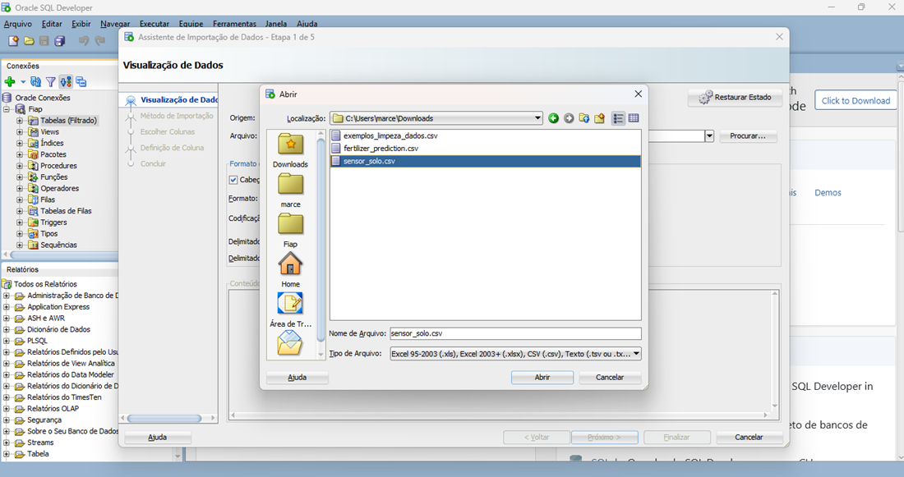
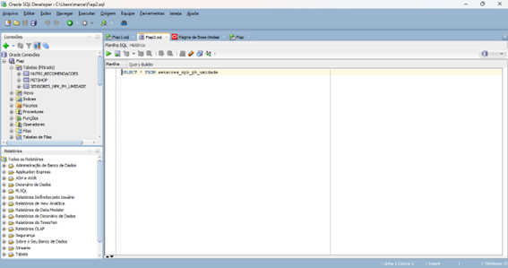
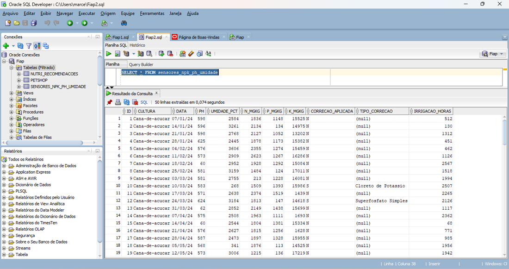
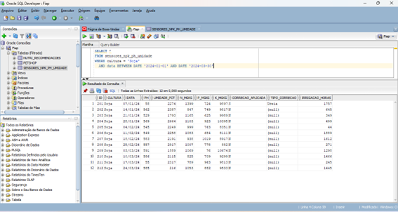
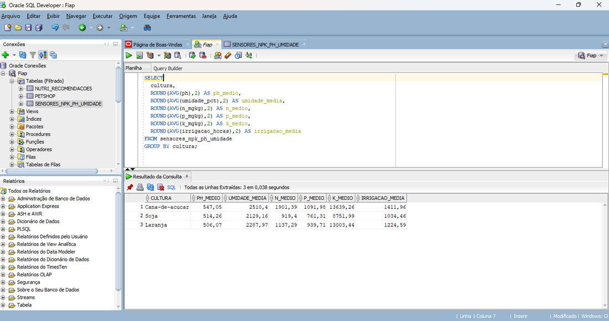
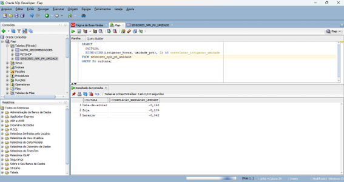
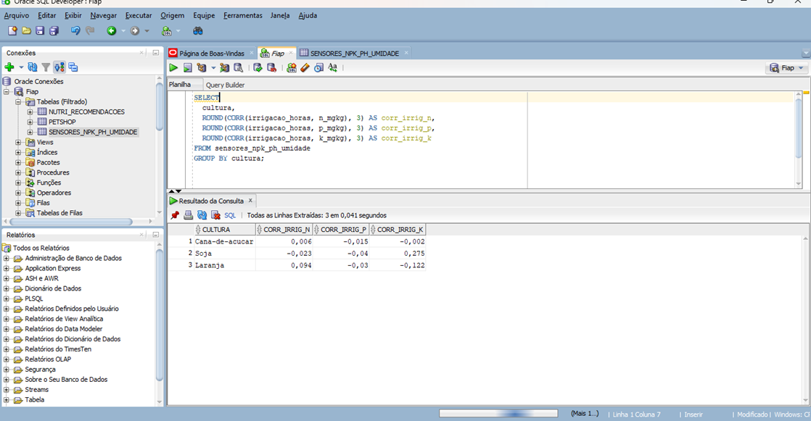

# 📊 Importação, Visualização e Análise de Dados no Oracle SQL Developer

## 🧭 Objetivo

Apresentar, de forma clara e organizada, o processo de inclusão, visualização e análise de dados no ambiente do **Oracle SQL Developer**, descrevendo as etapas necessárias para realizar essas operações de maneira eficiente e estruturada.

---

## 🌱 Contexto do Projeto

Na **fase 2** do projeto, foi desenvolvido um ambiente de simulação no **Wokwi**, representando um sistema de **monitoramento automatizado do solo**.
Esse sistema analisa os níveis de **potássio (K)**, **nitrogênio (N)**, **fósforo (P)** e **umidade** em uma plantação.

Com base nas leituras dos sensores, o sistema foi programado para acionar automaticamente a irrigação sempre que determinados parâmetros estivessem abaixo dos limites adequados.
Embora simplificado, o modelo serve como demonstração do comportamento automatizado em condições controladas. 

Como não foram coletados dados reais nesta etapa, buscou-se referências em fontes públicas de dados agrícolas brasileiras para gerar um banco de dados sintético, com valores coerentes com condições típicas de solos cultivados no país.

---

## 🗂️ Estrutura do Banco de Dados

| Coluna              | Tipo         | Descrição                                         |
| ------------------- | ------------ | ------------------------------------------------- |
| `id`                | INTEGER      | Identificador único autoincremental               |
| `cultura`           | VARCHAR      | Tipo de cultura agrícola                          |
| `data`              | DATE         | Data da leitura semanal                           |
| `ph`                | NUMERIC(3,2) | pH do solo                                        |
| `umidade_pct`       | NUMERIC(5,2) | Umidade do solo (%)                               |
| `n_mgkg`            | NUMERIC(7,2) | Nitrogênio (mg/kg)                                |
| `p_mgkg`            | NUMERIC(7,2) | Fósforo (mg/kg)                                   |
| `k_mgkg`            | NUMERIC(7,2) | Potássio (mg/kg)                                  |
| `correcao_aplicada` | VARCHAR(1)   | Indica se houve correção nutricional (“S” ou “N”) |
| `irrigacao_horas`   | NUMERIC(5,2) | Total de horas de irrigação na semana             |

**Resumo do dataset:**

* 300 registros (100 por cultura)
* Período: 100 semanas consecutivas, iniciando em 01/01/2024
* Culturas monitoradas: **Cana-de-açúcar**, **Laranja**, **Soja**

Os valores foram gerados dentro de faixas plausíveis para solos agrícolas brasileiros, com **variações sazonais simuladas** (umidade, nutrientes, correções nutricionais, etc.).

---

## 🧮 Manipulação e Análise de Dados

### Extração dos dados e criação do banco no Oracle

Os valores foram gerados dentro de faixas plausíveis para solos agrícolas brasileiros, considerando referências técnicas e publicações nacionais sobre as culturas selecionadas.

Foram incluídas variações sazonais simuladas para refletir o comportamento esperado ao longo do ano — como aumento da umidade em períodos chuvosos e diluição de nutrientes — além de eventos de correção nutricional que impactam temporariamente os níveis de N, P e K. Abaixo segue print de tela demonstrando a importação da planilha em Excel denominada sensor_solo.csv.

Os prints a seguir demonstram o banco de dados criado, denominado SENSORES_NPK_PH_UMIDADE, bem como a sua visualização por meio do comando SELECT * FROM sensores_npk_ph_umidade. É importante observar que a variável TIPO_CORRECAO apresenta alguns valores ausentes, uma vez que as correções de nutrientes são eventos esporádicos e não correm em todas as semanas do período analisado.

### 🔍 Filtragem de Dados

Foram aplicados filtros para selecionar a cultura **Soja** no período de **01/01/2024 a 30/03/2024**, permitindo uma observação detalhada do comportamento de pH, umidade e nutrientes.

### 📈 Agregação e Estatísticas Descritivas

Foi realizada uma agregação por cultura para calcular as médias de pH, umidade, nutrientes e irrigação.

**Resultados:**

* **Cana-de-açúcar:** maiores médias de N e K, que sinaliza que a cultura exige mais nutrientes em comparação com as demais.
* **Soja:** valores equilibrados e irrigação moderada.
* **Laranja:** apresenta valores de irrigação elevandos em relação a soja e umidade não elevada o que indica um região de poucas chuvas.

---

## 🔗 Correlações

### 💧 Irrigação x Umidade

A análise da correlação entre as horas de irrigação (irrigacao_horas) e o percentual de umidade do solo (unidade_pct) revelou uma relação linear consistentemente fraca e negativa para todas as culturas examinadas (Cana-de-açúcar: -0,146; Soja: -0,109; Laranja: -0,042).

Os coeficientes, por estarem próximos de zero, indicam que o tempo de irrigação, isoladamente, demonstra ter influência linear muito limitada sobre a variação da umidade registrada. O sinal negativo, embora fraco, sugere que, à medida que as horas de irrigação aumentam, o percentual de umidade apresenta uma ligeira tendência de queda, o que é um resultado contraintuitivo e que requer investigação adicional. Sugere-se a avaliação de fatores externos (chuva, evapotranspiração, drenagem) e a consideração de um atraso temporal entre a irrigação e a medição da umidade para uma compreensão mais precisa da dinâmica hídrica.

### 🌾 Irrigação x Nutrientes

Análise de correlação de **Pearson** entre irrigação e nutrientes (N, P, K):

| Cultura        | Tendência                     | Interpretação                       |
| -------------- | ----------------------------- | ----------------------------------- |
| Laranja        | Correlação positiva moderada  | Irrigação ajuda a manter nutrientes |
| Soja           | Correlação levemente negativa | Diluição temporária dos nutrientes  |
| Cana-de-açúcar | Correlação equilibrada        | Retenção prolongada de nutrientes   |

---

## 🧩 Conclusão

A análise evidencia a importância de compreender a interação entre irrigação e nutrição do solo.
Os resultados obtidos podem subsidiar **ajustes de manejo hídrico e nutricional**, promovendo uso racional de água e insumos.

---

## 💻 Tecnologias Utilizadas

* **Oracle SQL Developer**
* **Wokwi (simulação de sensores)**
* **CSV Dataset (sensor_solo.csv)**

